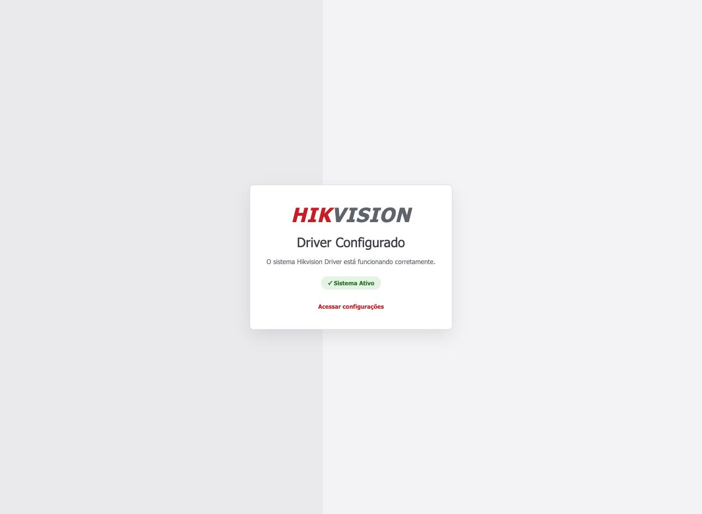

# Guia Senior X

Do zero até a catraca funcionando, em seis etapas. Siga na ordem: cada uma
depende da anterior.

O caminho é sempre o mesmo — você **instala** o driver no servidor, **aponta**
ele para a Senior, **cadastra** os equipamentos na Senior, e por fim
**testa uma passagem de verdade**. Reserve algo entre uma e duas horas na
primeira vez.

!!! tip "Duas metades que precisam se encontrar"
    Metade do trabalho é no servidor (etapas 2 e 3) e metade é dentro da Senior
    (etapa 4). A integração só funciona quando as duas se encontram — por isso
    a etapa 5 existe: ela prova que o encontro aconteceu.

---

## Etapa 1 — Antes de começar

Junte tudo antes de sentar no servidor. Faltar um item aqui costuma custar uma
segunda visita ao cliente.

### Tenha em mãos

- [ ] **Driver key** emitida pela Senior para esta instalação
- [ ] Acesso administrador ao servidor Windows
- [ ] IP fixo (ou reserva de DHCP) para o servidor do driver
- [ ] Credenciais dos equipamentos Hikvision, se exigirem
- [ ] **ASP.NET Core Runtime 9.0 x64** instalado — o instalador confere e não
      avança sem ele

### Libere a rede

| Origem | Destino | Porta | Para quê |
|---|---|---|---|
| **Equipamento** | **Driver** | **5000** | **Entrega dos eventos de acesso** |
| Driver | Equipamento | 80 / 443 | Configuração, credenciais, sondagem |
| Driver | `sam-api.senior.com.br` | 443 | API REST e WebSocket |

!!! danger "Confirme o sentido equipamento → driver"
    Repare na primeira linha da tabela: a origem é o **equipamento**, não o
    servidor. É a que mais falha, porque quem configura o firewall tende a
    pensar só no sentido servidor → catraca.

    Teste a partir do equipamento. Se ele tiver navegador ou console, abra
    `http://<ip-do-driver>:5000/health` de lá. Se responder, o caminho existe.

!!! note "Atenção a proxy corporativo"
    A Senior X envia trabalho ao driver — cargas de cartão, comandos — por um
    canal permanente chamado WebSocket (`wss://`). Alguns proxies corporativos
    que inspecionam tráfego HTTP derrubam esse tipo de conexão.

    O sintoma é característico: a comunicação comum funciona, mas as cargas
    nunca chegam. Se o cliente tem proxy, confirme com a equipe de rede que
    WebSocket passa.

---

## Etapa 2 — Instalar o driver

Execute `Hikvision Driver-Setup-2.2.1.exe` **como administrador**.

O assistente tem quatro telas:

**1. Boas-vindas** — identifica o produto (Hikvision Driver, versão 2.2.1).
Clique em Avançar.

**2. Configuração Personalizada** — pede o **Nome do Serviço**, com o padrão
`HIKVISION-DRIVER`. É o nome usado em `sc start` e `sc stop`. Mantenha o padrão,
salvo se houver mais de uma instância na mesma máquina. Campo obrigatório.

**3. Diretório de destino** — padrão `C:\HikvisionDriver`.

**4. Pronto para instalar** — o instalador confere o ASP.NET Core Runtime 9.0.
Se não encontrar, informa o endereço de download e oferece Repetir; instale o
runtime em outra janela e clique em Repetir.

Ao confirmar, o instalador copia os arquivos, cria o serviço com início
automático e o inicia. Sua configuração anterior, se houver, é preservada.

Confirme:

```bat
sc query HIKVISION-DRIVER
```

Esperado: `RUNNING`.

---

## Etapa 3 — Configurar o driver

Abra no navegador:

```
http://<ip-do-servidor>:5000/config
```

{ loading=lazy }

Preencha:

| Campo | Valor |
|---|---|
| **Terceiro** | `SeniorX` |
| **Porta da API** | `5000` |
| **Usuario do Painel** | `admin` |
| **Senha do Painel** | defina uma senha |
| **IPs permitidos** | IPs de gestão, ou deixe vazio |
| **Driver Key** | a chave emitida pela Senior |

!!! tip "Defina a senha do painel agora"
    O painel só passa a exigir login depois que a senha é preenchida. Como esta
    tela altera a configuração da integração, defina-a nesta primeira passagem.

Clique em **Salvar**. Se faltar campo obrigatório, aparece
`Preencha as propriedades obrigatorias:` com a lista, e nada é gravado.

Gravando com sucesso:

{ loading=lazy }

O driver reinicia sozinho.

---

## Etapa 4 — Cadastrar na Senior X

Até aqui o driver está no ar, mas sozinho: ele não sabe que equipamentos
existem. Quem conta isso a ele é a Senior.

O raciocínio é o seguinte. Você cadastra os equipamentos **na Senior**; a Senior
avisa o driver quais são; o driver então vai até cada um deles, configura, e
passa a monitorá-los. Você nunca cadastra um equipamento dentro do driver — ele
sempre recebe essa informação da plataforma.

!!! note "Nomes de menu variam por versão da plataforma"
    Os nomes abaixo descrevem **o que** precisa existir. O caminho exato de menu
    pode variar conforme a versão do Senior X — procure pelo objeto, não pelo
    caminho.

### O que precisa existir

| Objeto | Para quê |
|---|---|
| **Driver** | Representa esta instalação; emite a *driver key* |
| **Dispositivo** | Cada controladora Hikvision |
| **Associação dispositivo ↔ driver** | Diz à Senior por qual driver falar com cada equipamento |
| **Leitoras** | Os pontos de leitura de cada dispositivo |
| **Permissões de acesso** | Quem pode passar, onde e quando |

### Propriedades extensíveis do dispositivo

Esta parte costuma passar despercebida, e é a que mais trava instalação.

Funciona em **duas telas**: primeiro alguém cria um **conjunto nomeado** de
propriedades, no cadastro de propriedades extensíveis; depois, no cadastro do
dispositivo, você **seleciona esse conjunto** numa lista.

{ loading=lazy }

*O campo fica à direita, no bloco Gerenciador. Valores do ambiente borrados.*

Se o conjunto que você precisa não aparece na lista, ele ainda não foi criado —
volte ao cadastro de propriedades extensíveis.

As chaves que o driver lê dentro do conjunto:

| Propriedade | Obrigatória | Valor |
|---|:--:|---|
| `driverAddress` | **✓** | `http://<ip-do-driver>:5000` — o endereço que o equipamento vai usar |
| `model` | | Modelo do equipamento, ex.: `DS-K1T671M` |

!!! tip "Atalho: defina o endereço uma vez, para toda a frota"
    Se todos os equipamentos apontam para o mesmo servidor, em vez de preencher
    `driverAddress` em cada dispositivo você pode preencher a chave
    `seniorxt.ext.server.address` na configuração do driver — ela vale como
    alternativa global, para as duas plataformas. Ver
    [Propriedades](propriedades.md#driveraddress).

!!! danger "`driverAddress` é o que faz a integração funcionar"
    O driver usa essa propriedade para configurar o equipamento a enviar os
    eventos de acesso. **Sem ela o provisionamento falha** com
    `Extensible Property driverAddress not found`, e o equipamento nunca passa a
    reportar passagens.

    Use o endereço que o **equipamento** enxerga. Se driver e equipamento
    estiverem em redes distintas, é o endereço roteável entre elas — não
    `localhost`, não o IP interno de outra VLAN.

!!! warning "IP fixo é requisito, não recomendação"
    Esse endereço fica gravado no equipamento. Se o IP do servidor mudar, os
    equipamentos continuam apontando para o antigo e os eventos param de chegar.

### Fotos e reconhecimento facial

Para o equipamento reconhecer rostos, a Senior precisa enviar as fotos das
pessoas ao driver, que as grava em cada dispositivo. Habilite o uso de fotos na
plataforma e confirme que as pessoas têm foto cadastrada.

A carga acontece pessoa a pessoa: se a foto de alguém for recusada, as demais
seguem normalmente e o log registra qual falhou e por quê.

!!! warning "Em Senior X, planeje a remoção no desligamento"
    A carga facial no Senior X **acrescenta e atualiza, mas não apaga**. Quando
    uma pessoa deixa a lista, o rosto dela continua gravado no equipamento até
    que alguém o remova por outro meio.

    Isso importa por dois motivos. O prático: um ex-funcionário pode continuar
    passando. E o legal: rosto é dado biométrico, que a LGPD trata como dado
    pessoal sensível — mantê-lo sem necessidade é irregularidade.

    Defina com o cliente, já na implantação, como a remoção será feita no
    desligamento.

---

## Etapa 5 — Validar

Seis verificações, em ordem crescente de profundidade. As quatro primeiras
confirmam que cada peça está de pé; **só a quinta prova que elas se falam**.

Não pule para o fim: quando algo falha, saber em qual verificação parou já
indica onde está o problema.

**1. O serviço está no ar**

```bat
sc query HIKVISION-DRIVER
```

**2. O health responde**

```bat
curl -i http://localhost:5000/health
```

Esperado `200`. Um `503` indica driver, API ou WebSocket fora.

**3. O painel mostra o esperado**

Abra `http://<ip>:5000/diagnostic`:

{ loading=lazy }

- [ ] Plataforma `seniorx`, `WebSocket` verde
- [ ] Número de dispositivos bate com o cadastrado
- [ ] Nenhum offline

**4. Os testes de conectividade passam**

Botão **Testar** em cada dispositivo, e o teste com a Senior.

**5. Uma passagem de teste chega**

Passe um cartão ou face numa catraca, com pessoa autorizada. Confirme que
liberou e que o evento aparece na aba **Eventos**:

{ loading=lazy }

!!! danger "Se liberou mas não apareceu"
    O evento não está chegando ao driver. Revise o sentido
    **equipamento → driver** no firewall e a propriedade `driverAddress`.

**6. A negativa também funciona**

Passe alguém **sem** permissão e confirme que nega. Uma integração que libera
todo mundo não está validando.

---

## Etapa 6 — Deixar operando

Instalado e validado, falta combinar como o cliente vai perceber um problema
antes que alguém fique preso na catraca.

### Monitoramento

Um ponto importante: **o driver não avisa ninguém**. Não há envio de e-mail nem
push quando algo cai. Ele responde quando perguntado — então o monitoramento do
cliente (Zabbix, PRTG, o que já usarem) precisa perguntar de tempos em tempos.

Sem isso, uma queda passa despercebida até alguém reclamar.

| O que | Onde | Alertar quando |
|---|---|---|
| Saúde geral | `GET /health` | Código diferente de `200` |
| Dispositivos fora | `/diagnostic/data` → `offlineDevices` | Alto e constante |
| Eventos represados | `retryQueueSize` | Crescendo sem esvaziar |
| Eventos desistidos | `deadLetterSize` | **Qualquer valor acima de zero** |

Exemplo de gatilho no Zabbix, sobre um item *HTTP agent* apontando para
`http://{HOST.CONN}:5000/health`:

```
last(/HikvisionDriver/hik.health.status)<>200
```

### Logs

Ficam em `C:\HikvisionDriver\log\log-AAAAMMDD.txt`, e também na aba **Logs** do
painel:

{ loading=lazy }

Segredos são mascarados automaticamente.

### Eventos represados

Quando o driver não consegue entregar um evento à Senior, ele guarda em vez de
descartar e tenta de novo a cada 30 segundos. Isso resolve sozinho quedas
temporárias.

Se um evento for recusado de forma definitiva — ou se passar de 24 h tentando —
ele vai para uma pasta à parte, chamada `deadletter`. **Nada acontece com esses
arquivos até alguém agir.** Por isso o indicador `deadLetterSize` merece alerta:
qualquer valor acima de zero significa registro de acesso que não chegou à
Senior.

Depois de diagnosticar e corrigir a causa, devolva os arquivos à fila:

```bat
move C:\HikvisionDriver\events\deadletter\*.json C:\HikvisionDriver\events\
```

### Queda da Senior

O driver reconecta sozinho. Durante a queda, **o acesso é negado** — não há
liberação local. Os eventos ocorridos são guardados e reenviados quando a
conexão volta.

---

## Atualizar e desinstalar

**Atualizar:** rode o instalador novo por cima, com o mesmo nome de serviço. A
configuração é preservada.

**Desinstalar:** remove o diretório de instalação inteiro, com configuração,
logs e eventos não entregues. Faça backup antes:

```bat
sc stop HIKVISION-DRIVER
xcopy C:\HikvisionDriver\middleware.properties C:\backup-hikvision\ /Y
xcopy C:\HikvisionDriver\events C:\backup-hikvision\events\ /E /I /Y
```

---

Problemas? Vá para **[Problemas](problemas.md)**.
Detalhe de cada parâmetro em **[Propriedades](propriedades.md)**.
