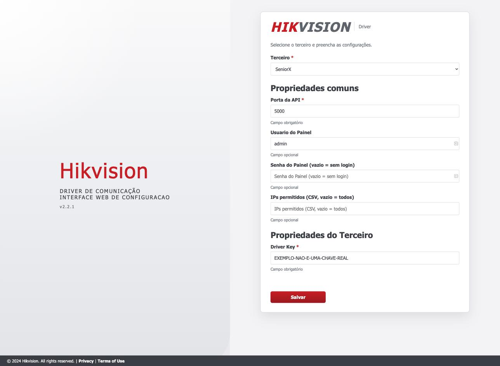
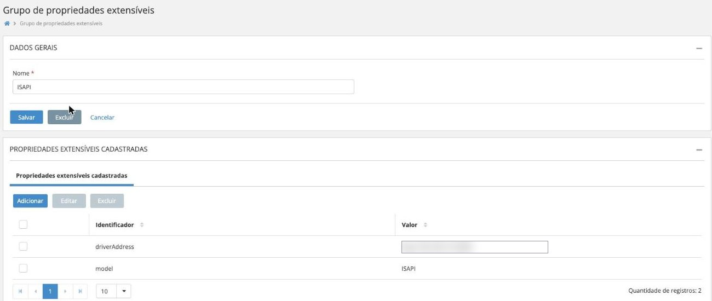
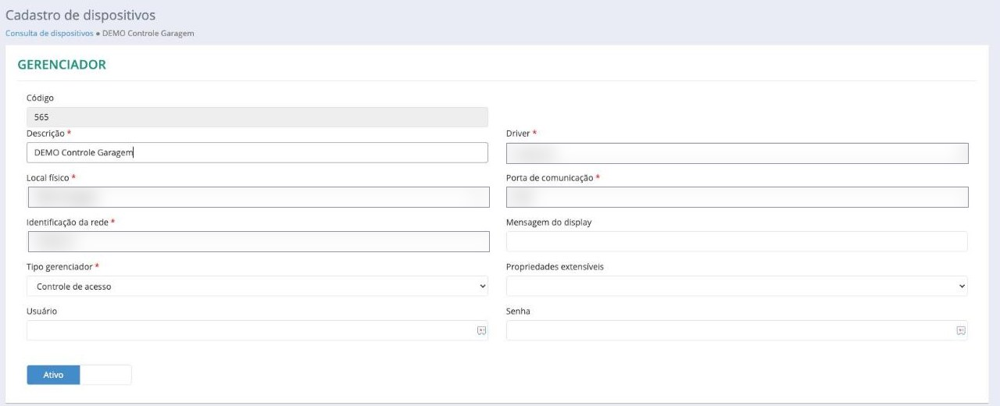

# Guia Senior XT

Do zero até a catraca funcionando, em sete etapas. Siga na ordem: cada uma
depende da anterior.

Diferente do Senior X, aqui a plataforma não está na nuvem: existe uma
**Concentradora** rodando na rede do cliente, e é com ela que o driver conversa.
Na prática isso muda três coisas — a integração não depende de internet, exige
um arquivo de certificado, e é acompanhada de forma um pouco diferente.

Reserve entre uma e duas horas na primeira vez.

!!! tip "Duas metades que precisam se encontrar"
    Metade do trabalho é no servidor (etapas 2 a 4) e metade é dentro da Senior
    (etapa 5). A etapa 6 existe para provar que as duas se encontraram.

---

## Etapa 1 — Antes de começar

Junte tudo antes de sentar no servidor. Faltar um item aqui costuma custar uma
segunda visita ao cliente.

### Tenha em mãos

- [ ] Endereço e **porta** da Concentradora
- [ ] Endereço do **servlet CSM** (usado na consulta de fotos)
- [ ] **Driver ID** numérico, conforme cadastrado na Senior
- [ ] **Arquivo `HIK.CER`** — o instalador **não** o empacota
- [ ] Acesso administrador ao servidor Windows
- [ ] IP fixo (ou reserva de DHCP) para o servidor do driver
- [ ] **ASP.NET Core Runtime 9.0 x64** instalado

### Libere a rede

| Origem | Destino | Porta | Para quê |
|---|---|---|---|
| **Equipamento** | **Driver** | **5000** | **Entrega dos eventos de acesso** |
| Driver | Equipamento | 80 / 443 | Configuração, credenciais, sondagem |
| Driver | Concentradora | conforme configurado | Protocolo CSM |
| Driver | Servlet CSM | conforme a URL | Consulta de fotos |

!!! danger "Confirme o sentido equipamento → driver"
    Repare na primeira linha da tabela: a origem é o **equipamento**, não o
    servidor. É a que mais falha, porque quem configura o firewall tende a
    pensar só no sentido servidor → catraca.

    Teste a partir do equipamento. Se ele tiver navegador ou console, abra
    `http://<ip-do-driver>:5000/health` de lá. Se responder, o caminho existe.

---

## Etapa 2 — Instalar o driver

Execute `Hikvision Driver-Setup-2.2.1.exe` **como administrador**.

**1. Boas-vindas** — clique em Avançar.

**2. Configuração Personalizada** — **Nome do Serviço**, padrão
`HIKVISION-DRIVER`. Campo obrigatório. Anote se alterar.

**3. Diretório de destino** — padrão `C:\HikvisionDriver`.

**4. Pronto para instalar** — confere o ASP.NET Core Runtime 9.0. Se faltar,
instale em outra janela e clique em Repetir.

Confirme:

```bat
sc query HIKVISION-DRIVER
```

---

## Etapa 3 — Colocar o certificado

A comunicação com a Concentradora é autenticada por um certificado — um arquivo
que prova ao servidor da Senior que este driver é quem diz ser.

!!! danger "Faça isto antes de configurar"
    O instalador **não** empacota o `HIK.CER`. Copie o arquivo para o diretório
    de instalação **antes** de preencher a configuração:

    ```
    C:\HikvisionDriver\HIK.CER
    ```

    Sem ele a autenticação com a Concentradora falha — e o sintoma engana: o
    serviço sobe normalmente, o painel abre, e a integração simplesmente não
    estabelece.

Se usar outro nome de arquivo, informe-o no campo **Certificado** da próxima
etapa. O campo espera o **nome do arquivo**, não um caminho completo.

Guarde uma cópia fora da máquina: a desinstalação apaga o diretório inteiro.

---

## Etapa 4 — Configurar o driver

```
http://<ip-do-servidor>:5000/config
```

{ loading=lazy }

Selecione **SeniorXT** em Terceiro e preencha:

| Campo | Valor |
|---|---|
| **Porta da API** | `5000` |
| **Senha do Painel** | defina uma senha |
| **Endereço da Concentradora** | host ou IP |
| **Porta da Concentradora** | porta TCP |
| **CSM Servlet (Consulta de fotos)** | endereço do servlet |
| **Driver ID** | o mesmo número cadastrado na Senior |
| **Certificado** | `HIK.CER` |
| **Usuário / Senha do Equipamento** | opcionais; ver nota abaixo |
| **Endereço Middleware** | opcional |

!!! note "Credenciais do equipamento"
    Os campos **Usuário do Equipamento** e **Senha** valem para toda a
    instalação. Se um equipamento tiver credencial própria, informe-a nas
    propriedades extensíveis do dispositivo (etapa 5) — elas têm precedência.

Clique em **Salvar**. O driver reinicia sozinho.

---

## Etapa 5 — Cadastrar na Senior XT

Até aqui o driver está no ar, mas sozinho: ele não sabe que equipamentos
existem. Quem conta isso a ele é a Senior.

Você cadastra os equipamentos **na plataforma**; ela avisa o driver; o driver vai
até cada um, configura e passa a monitorá-los. Você nunca cadastra um
equipamento dentro do driver.

!!! note "Nomes de menu variam por versão da plataforma"
    Os nomes abaixo descrevem **o que** precisa existir. O caminho exato de menu
    pode variar conforme a versão da plataforma — procure pelo objeto, não pelo
    caminho.

### O que precisa existir

| Objeto | Para quê |
|---|---|
| **Driver** | Com o identificador numérico que você informou em Driver ID |
| **Catálogo** | Descreve o modelo do equipamento e seus acoplados |
| **Tecnologia biométrica** | Declara que o equipamento faz reconhecimento facial |
| **Dispositivo** | Cada controladora Hikvision |
| **Leitoras** | Leitora facial e leitoras de cartão |

!!! note "Sem tecnologia biométrica declarada, não há carga facial"
    A plataforma só envia as pendências de carga facial se o equipamento estiver
    declarado como capaz. Se as fotos nunca chegam ao equipamento, comece por
    aqui.

### Propriedades extensíveis do dispositivo

Esta parte costuma passar despercebida, e é a que mais trava instalação.

Funciona em **duas telas**:

1. Em **Gestão de Acesso e Segurança → Grupo de propriedades extensíveis**, crie
   um grupo com as chaves abaixo.
2. No cadastro do dispositivo, **selecione esse grupo** no campo
   *Propriedades extensíveis*.

{ loading=lazy }

*O grupo precisa de apenas duas propriedades. Endereço borrado nesta imagem.*

{ loading=lazy }

*O campo fica à direita, no bloco Gerenciador. Valores do ambiente borrados.*

!!! danger "Não reaproveite grupos de outras integrações"
    Ambientes com outros equipamentos costumam ter grupos de nome parecido —
    `Hikvision Device`, `Hikvision Leitora`, `Intelbras`. Eles usam chaves
    diferentes (`ipAddress`, `portNo`, `uri`) que **este driver não lê**.

    Selecionar um deles faz a integração falhar como se nada tivesse sido
    configurado. Na dúvida, crie um grupo novo. Ver
    [Propriedades](propriedades.md#passo-1-criar-o-grupo).

As chaves que o driver lê dentro do grupo:

| Propriedade | Obrigatória | Valor |
|---|:--:|---|
| `driverAddress` | **✓** | `http://<ip-do-driver>:5000` |
| `model` | | Modelo do equipamento, ex.: `DS-K1T671M` |
| `username` | | Usuário daquele equipamento |
| `password` | | Senha daquele equipamento |

!!! tip "Atalho: defina o endereço uma vez, para toda a frota"
    Se todos os equipamentos apontam para o mesmo servidor, em vez de preencher
    `driverAddress` em cada dispositivo você pode preencher a chave
    `seniorxt.ext.server.address` na configuração do driver — ela vale como
    alternativa global, para as duas plataformas. Ver
    [Propriedades](propriedades.md#driveraddress).

!!! danger "`driverAddress` é o que faz a integração funcionar"
    O driver usa essa propriedade para configurar o equipamento a enviar os
    eventos. **Sem ela o provisionamento falha** com
    `Extensible Property driverAddress not found`.

    Use o endereço que o **equipamento** enxerga — não `localhost`, não o IP
    interno de outra VLAN.

!!! tip "`username` e `password` sobrepõem a configuração global"
    Quando presentes, valem para aquele dispositivo. Ausentes, o driver usa os
    campos **Usuário / Senha do Equipamento** da tela de configuração. Útil
    quando a frota tem credenciais diferentes.

---

## Etapa 6 — Validar

Sete verificações, em ordem crescente de profundidade. As quatro primeiras
confirmam que cada peça está de pé; **só a quinta prova que elas se falam**.

Uma diferença em relação ao Senior X: aqui a evidência de que a integração
estabeleceu está no **log** e na **lista de dispositivos**, não num indicador
único. Vale conhecer as duas mensagens do passo 2 — são elas que dizem se a
Concentradora aceitou o driver.

**1. O serviço está no ar**

```bat
sc query HIKVISION-DRIVER
```

**2. A autenticação com a Concentradora estabeleceu**

Abra `C:\HikvisionDriver\log\log-AAAAMMDD.txt` e procure:

| Encontrou | Significa |
|---|---|
| `Enviando autenticacao SeniorXT. Driver={DriverId}` | Handshake ocorreu |
| `Attempting SeniorXT reconnection` **repetindo** | Não estabeleceu — confira certificado, Driver ID, endereço e porta |
| `ClientCSMCommunication nao foi registrado` | Configuração Senior XT incompleta |

**3. O painel mostra os dispositivos**

{ loading=lazy }

- [ ] Plataforma `seniorxt`
- [ ] Número de dispositivos bate
- [ ] Nenhum offline

!!! note "Ignore o indicador de WebSocket aqui"
    Ele diz respeito ao Senior X e não reflete a Concentradora.

**4. Os testes de dispositivo passam**

Botão **Testar** em cada equipamento.

**5. Uma passagem de teste chega**

Passe cartão ou face com pessoa autorizada. Confirme que liberou e que o evento
aparece na aba **Eventos**:

{ loading=lazy }

!!! danger "Se liberou mas não apareceu"
    Revise o sentido **equipamento → driver** e a propriedade `driverAddress`.

**6. A carga facial conclui**

- [ ] Fotos chegam ao equipamento
- [ ] Passagem por face libera
- [ ] Desligamento de teste **remove** a face do equipamento

!!! success "Em Senior XT a remoção é automática"
    A carga facial aqui **compara a lista atual com a anterior** e ajusta os dois
    lados: quem entrou é gravado, quem saiu é apagado do equipamento.

    É diferente do Senior X, onde a remoção precisa ser feita por outro meio.
    Como rosto é dado biométrico — dado pessoal sensível para a LGPD — essa
    diferença importa no processo de desligamento.

**7. A negativa funciona**

Passe alguém sem permissão e confirme que nega.

---

## Etapa 7 — Deixar operando

Instalado e validado, falta combinar como o cliente vai perceber um problema
antes que alguém fique preso na catraca.

### Monitoramento

Um ponto importante: **o driver não avisa ninguém**. Não há envio de e-mail nem
push quando algo cai. Ele responde quando perguntado — então o monitoramento do
cliente precisa perguntar de tempos em tempos.

| O que | Onde | Alertar quando |
|---|---|---|
| Dispositivos fora | `/diagnostic/data` → `offlineDevices` | Frota inteira offline de uma vez |
| Conexão com a Concentradora | log | `Attempting SeniorXT reconnection` repetindo |
| Serviço no ar | `GET /health` | Código diferente de `200` |

!!! note "Monte o alerta sobre os dois primeiros"
    Em Senior XT, o `/health` cobre o serviço do driver. A conexão com a
    Concentradora é acompanhada pelos indicadores operacionais — inclua-os no
    monitoramento.

### Logs

`C:\HikvisionDriver\log\log-AAAAMMDD.txt`, e na aba **Logs** do painel:

{ loading=lazy }

### Queda da Concentradora

O driver reconecta sozinho, com espera crescente de 5 s até 120 s. Durante a
queda, **o acesso é negado** — não há liberação local.

!!! note "A fila de reenvio é específica do Senior X"
    Os parâmetros `seniorx.eventretry.*` não se aplicam a instalações Senior XT.
    A fila de mensagens desta plataforma é em memória e não sobrevive a
    reinício do serviço.

---

## Atualizar e desinstalar

**Atualizar:** rode o instalador novo por cima, com o mesmo nome de serviço.
Configuração e certificado são preservados.

**Desinstalar:** remove o diretório inteiro, incluindo o `HIK.CER`. Faça backup:

```bat
sc stop HIKVISION-DRIVER
xcopy C:\HikvisionDriver\middleware.properties C:\backup-hikvision\ /Y
xcopy C:\HikvisionDriver\HIK.CER C:\backup-hikvision\ /Y
```

---

Problemas? Vá para **[Problemas](problemas.md)**.
Detalhe de cada parâmetro em **[Propriedades](propriedades.md)**.
