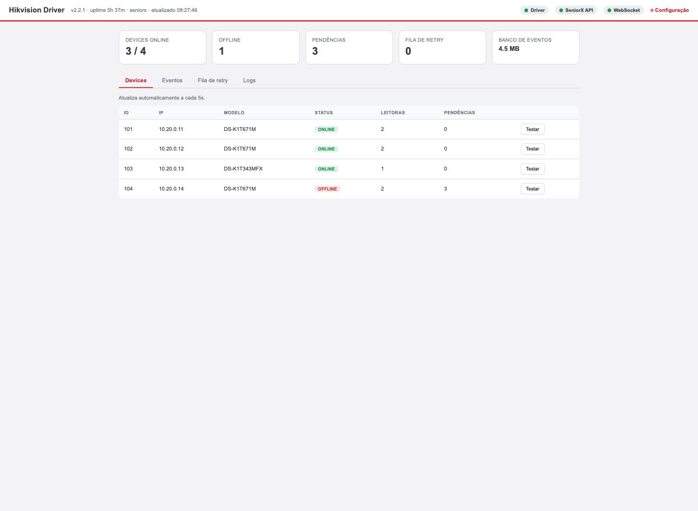
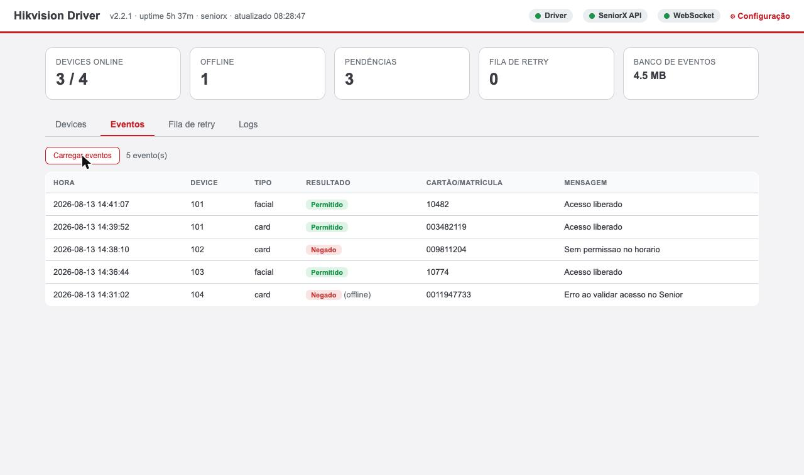
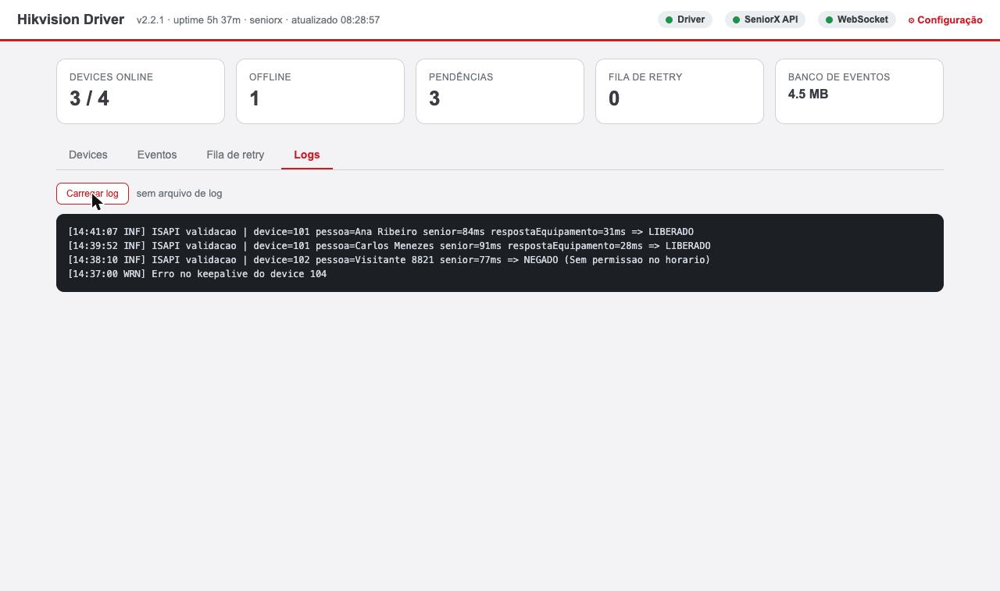

# Tela de diagnóstico

O driver traz um painel próprio de diagnóstico. É o primeiro lugar para olhar
quando alguém reclama, antes de abrir log.

```
http://<host>:5000/diagnostic
```

Exige as credenciais do painel (`middleware.api.user` / `middleware.api.password`).

{ loading=lazy }

Os cinco cartões no topo dão o resumo imediato: dispositivos online, offline,
pendências, fila de reenvio e tamanho do banco. A lista abaixo detalha cada
equipamento, com botão de teste individual.

## O que a tela mostra

| Bloco | Conteúdo |
|---|---|
| Identificação | Versão do driver, plataforma em uso, porta, tempo desde o start |
| Estado | Driver pronto, API da Senior pronta, estado do WebSocket |
| Estatísticas | Contadores de dispositivos, pendências, filas e banco |
| Dispositivos | Lista com o estado online/offline de cada equipamento |
| Fila de reenvio | Situação dos eventos aguardando entrega |

## Os indicadores que importam

Disponíveis também em `/diagnostic/data`, em JSON, para monitoramento.

### Dispositivos

| Campo | Leitura saudável | Quando preocupar |
|---|---|---|
| `totalDevices` | Igual ao número de equipamentos cadastrados | Menor → falta cadastro ou associação na Senior |
| `onlineDevices` | Igual ao total | — |
| `offlineDevices` | Zero | Alto e constante: equipamentos inalcançáveis ou keepalive mal dimensionado |

### Filas

| Campo | Leitura saudável | Quando preocupar |
|---|---|---|
| `totalPending` | Baixo e variando | Cresce sem parar → processamento não vence a demanda |
| `retryQueueSize` | Zero | Crescendo → Senior indisponível ou recusando |
| `deadLetterSize` | **Zero** | Qualquer valor exige ação manual |
| `inboxPending` | Zero fora do boot | Acima de zero → webhooks atrasados; investigue CPU e disco |
| `inboxAddFailures` | **Zero** | Acima de zero → problema de disco ou banco; a durabilidade está degradada |

!!! danger "`inboxAddFailures` é o indicador mais sério da tela"
    Ele significa que o driver não conseguiu persistir o evento bruto antes de
    confirmar o recebimento. Nessa condição, um crash **perde** eventos — a
    garantia de durabilidade deixou de valer. Trate como incidente de
    infraestrutura.

### Estado da integração

| Campo | Observação |
|---|---|
| `driverReady` | O serviço interno subiu |
| `seniorxApiReady` | A API da Senior respondeu — só significativo em Senior X |
| `websocketState` | Estado textual do canal. `Open` é o esperado |
| `websocketConnected` | Atalho booleano do anterior |

!!! warning "Em Senior XT estes campos não refletem a Concentradora"
    Os indicadores de API e WebSocket dizem respeito ao Senior X. Numa instalação
    Senior XT, use `offlineDevices` e o log como evidência. Ver
    [Health check e monitoramento](health-e-monitoramento.md).

## Testes de conectividade

O painel expõe dois testes acionáveis:

| Teste | Rota | Para quê |
|---|---|---|
| Dispositivo | `POST /diagnostic/test/device/{id}` | Confirma que o driver alcança aquele equipamento |
| Senior | `POST /diagnostic/test/seniorx` | Confirma que o driver alcança a plataforma |

!!! note "O teste de dispositivo não prova o caminho de volta"
    Ele verifica o sentido **driver → equipamento**. A entrega de eventos usa o
    sentido oposto, que precisa ser validado separadamente — é a causa mais comum
    de "nada acontece". Ver [Rede e portas](../antes-de-instalar/rede-e-portas.md).

## Eventos recentes

```
GET /diagnostic/events
```

A aba **Eventos** mostra as passagens recentes, com tipo (cartão ou facial),
resultado e a mensagem devolvida:

{ loading=lazy }

É o caminho mais rápido para confirmar se uma passagem de teste chegou.

## Log pela web

```
GET /diagnostic/logs
```

A aba **Logs** evita precisar de acesso ao disco da máquina:

{ loading=lazy }

Para o arquivo completo, ver [Logs](logs.md).
