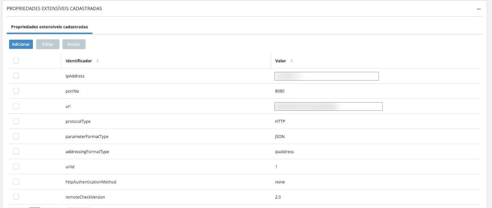

# Propriedades

Duas coisas diferentes se chamam "propriedade" nesta integração, e confundi-las
é fonte comum de erro.

Pense assim: uma configura **o driver**, a outra configura **cada equipamento**.

| | Onde fica | Quem edita | Vale para |
|---|---|---|---|
| **Configuração do driver** | Arquivo `middleware.properties`, no servidor | Você, pela tela `/config` | A instalação inteira |
| **Propriedades extensíveis** | Cadastro do dispositivo, dentro da Senior | Você, na plataforma | Um equipamento só |

Se um único equipamento se comporta diferente dos outros, o problema tende a
estar nas extensíveis. Se **nada** funciona, olhe a configuração do driver.

---

## Propriedades extensíveis

São valores que a plataforma repassa ao driver sem interpretar. É por aí que o
driver descobre **para onde o equipamento deve mandar os eventos**.

O funcionamento envolve **duas telas**, e confundi-las é fonte de erro:

| Passo | Tela | O que se faz |
|---|---|---|
| 1 | **Grupo de propriedades extensíveis** | Cria-se um grupo com as chaves e valores |
| 2 | **Cadastro de dispositivos** | Seleciona-se o grupo na lista |

No dispositivo você **não digita** chave e valor — escolhe um grupo já pronto. Se
o grupo que você precisa não aparece na lista, ele ainda não foi criado.

### Passo 1 — Criar o grupo

Em **Gestão de Acesso e Segurança → Grupo de propriedades extensíveis**, clique
em **Adicionar**, dê um nome ao grupo e cadastre as propriedades.

Para este driver, o grupo precisa de apenas duas:

{ loading=lazy }

*Grupo nomeado `ISAPI`, com as duas propriedades que o driver lê. O endereço está
borrado nesta imagem.*

| Identificador | Obrigatório | Valor |
|---|:--:|---|
| `driverAddress` | **✓** | `http://<ip-do-driver>:5000` |
| `model` | | Identificação livre do equipamento |

!!! danger "Não reaproveite grupos de outras integrações"
    Ambientes que já usam outros equipamentos costumam ter grupos com nomes
    parecidos — `Hikvision Device`, `Hikvision Leitora`, `MD400`, `Intelbras`.
    **Eles não servem para este driver.**

    Um grupo de outra integração tem chaves completamente diferentes:

    { loading=lazy }

    `ipAddress`, `portNo`, `uri`, `protocolType`… Este driver **não lê nenhuma
    delas**. Ele monta a configuração de notificação por conta própria e só
    precisa do `driverAddress`.

    Selecionar um grupo desses no dispositivo faz a integração falhar exatamente
    como se nada tivesse sido configurado. **Na dúvida, crie um grupo novo.**

!!! note "Por que só duas propriedades bastam"
    O driver preenche sozinho o resto da configuração de notificação do
    equipamento: o caminho `/api/v1/isapi`, o protocolo HTTP, o formato JSON e a
    ausência de autenticação são fixos no código. Do `driverAddress` ele extrai
    apenas o endereço e a porta.

    Por isso não adianta cadastrar `uri`, `protocolType` ou `portNo` — seriam
    ignorados.

### Passo 2 — Selecionar o grupo no dispositivo

No cadastro do dispositivo, campo **Propriedades extensíveis**:

{ loading=lazy }

*Valores do ambiente borrados nesta imagem.*

### As chaves que o driver lê

| Chave | Obrigatória | Plataforma | O que faz |
|---|:--:|---|---|
| `driverAddress` | **✓** | X e XT | Endereço do driver gravado no equipamento, para onde ele envia os eventos |
| `model` | | X e XT | Identificação do equipamento; aparece no painel de diagnóstico |
| `username` | | XT | Usuário daquele equipamento; sobrepõe a configuração global |
| `password` | | XT | Senha daquele equipamento; sobrepõe a configuração global |

### `driverAddress`

É a propriedade mais importante das quatro. Ela responde a uma pergunta simples:
**para qual endereço a catraca deve mandar os eventos?**

O driver lê esse valor e o grava dentro do equipamento. A partir daí, toda vez
que alguém passa, a catraca envia o evento para lá.

Formato: `http://<endereço-do-driver>:<porta>`, por exemplo
`http://10.20.0.5:5000`.

!!! tip "Você pode definir o endereço uma vez só, para toda a frota"
    O driver procura primeiro a propriedade `driverAddress` do dispositivo. Se
    ela estiver vazia, usa a chave `seniorxt.ext.server.address` da configuração
    do driver.

    Numa instalação em que todos os equipamentos apontam para o mesmo servidor —
    o caso mais comum — preencher a chave global é bem mais simples do que
    repetir o endereço em cada dispositivo. Reserve a propriedade por dispositivo
    para as exceções.

    Apesar do prefixo `seniorxt.`, **essa alternativa vale para as duas
    plataformas**.

!!! danger "Se as duas estiverem vazias, o equipamento nunca é configurado"
    O provisionamento falha com `Extensible Property driverAddress not found`, e
    o equipamento não passa a reportar passagens.

    É a causa daquele "instalei tudo e nada acontece" que sobrevive mesmo com o
    firewall correto: o caminho de rede está aberto, mas ninguém disse à catraca
    que ela deve usá-lo.

Quatro regras que costumam ser violadas:

1. **Use o endereço que o equipamento enxerga**, não o que você enxerga do seu
   computador. Nunca `localhost` — para a catraca, `localhost` é ela mesma.
2. **Se driver e equipamento estão em redes diferentes**, use o endereço
   roteável entre elas, não o IP interno de outra VLAN.
3. **A porta tem de bater** com `middleware.api.port` (5000 por padrão).
4. **O IP precisa ser fixo.** O valor fica gravado dentro do equipamento; se o
   servidor mudar de IP, as catracas continuam mandando para o endereço antigo e
   os eventos simplesmente param de chegar.

### `model`

Identifica o modelo do equipamento e aparece na coluna correspondente do painel
de diagnóstico. Não é obrigatória, mas facilita o suporte: sem ela, a coluna
fica vazia e fica difícil saber com que equipamento se está lidando.

### `username` e `password`

Só em Senior XT. Servem para equipamentos que exigem login.

Funcionam em cascata: **se estiverem preenchidas no dispositivo, valem para
ele**; se não, o driver usa `seniorxt.ext.username` e `seniorxt.ext.password` da
configuração geral.

Na prática, preencha a configuração geral com a credencial que a maioria usa, e
só informe aqui os equipamentos que fogem à regra.

---

## Configuração do driver

Fica em `middleware.properties`, no diretório de instalação, no formato
`chave=valor`. A maior parte é editável pela tela `/config`.

!!! info "Esta tabela é verificada automaticamente"
    Um teste na esteira compara esta página com as chaves realmente lidas pelo
    código. Chave nova sem documentação, ou documentação de chave inexistente,
    reprova o build.

### Essenciais

| Chave | Obrig. | Default | O que faz |
|---|:--:|---|---|
| `thirdpart` | ✓ | *(vazio)* | Plataforma: `seniorx` ou `seniorxt`. Sem valor válido o driver sobe sem integração |
| `middleware.api.port` | ✓ | `5000` | Porta em que o driver escuta. **É a que os equipamentos precisam alcançar** |
| `middleware.api.user` | | `admin` | Usuário do painel |
| `middleware.api.password` | | *(vazio)* | Senha do painel. Vazia = sem login |
| `middleware.api.allowlist` | | *(vazio)* | IPs autorizados, separados por vírgula. Vazio = todos |

### Senior X

| Chave | Obrig. | Default | O que faz |
|---|:--:|---|---|
| `seniorx.driver_key` | ✓ | *(vazio)* | **Segredo.** Identifica esta instalação. Sem ela o canal de pendências não sobe |
| `seniorx.api.url` | ✓ | `https://sam-api.senior.com.br/sdk/v1` | Endpoint REST. Editável só pelo arquivo |
| `seniorx.websocket.url` | ✓ | `wss://sam-api.senior.com.br/websocket/pendency` | Canal de pendências. Editável só pelo arquivo |

!!! note "As duas URLs não aparecem na tela"
    São filtradas do painel e apontam para a produção da Senior. Para outro
    ambiente, edite o arquivo e reinicie o serviço.

### Senior XT

| Chave | Obrig. | Default | O que faz |
|---|:--:|---|---|
| `seniorxt.server` | ✓ | *(vazio)* | Endereço da Concentradora |
| `seniorxt.port` | ✓ | *(vazio)* | Porta TCP da Concentradora |
| `seniorxt.csmservlet` | ✓ | *(vazio)* | Servlet CSM, usado na consulta de fotos |
| `seniorxt.driver` | ✓ | *(vazio)* | Driver ID, o mesmo cadastrado na Senior |
| `seniorxt.certificate` | ✓ | `HIK.CER` | Nome do arquivo de certificado no diretório de instalação |
| `seniorxt.ext.username` | | *(vazio)* | Usuário dos equipamentos, global |
| `seniorxt.ext.password` | | *(vazio)* | Senha dos equipamentos, global |
| `seniorxt.ext.server.address` | | *(vazio)* | **Endereço do driver para toda a frota.** Usado quando a propriedade `driverAddress` do dispositivo está vazia. Vale para as duas plataformas, apesar do prefixo |

### Ajuste fino

Nenhuma é obrigatória e todas já têm um valor padrão adequado à maioria das
instalações. Ficam comentadas no arquivo `middleware.properties.example` —
descomente só a que precisar mudar.

!!! tip "Não ajuste preventivamente"
    Mexer nesses valores sem um sintoma concreto costuma criar problema em vez de
    evitar. Só altere quando o comportamento observado justificar — por exemplo,
    equipamentos oscilando entre online e offline numa rede lenta.

| Chave | Default | O que faz |
|---|---|---|
| `seniorx.remotecheck.timeout` | `15` | Segundos que o equipamento aguarda a resposta da validação |
| `seniorx.keepalive.device.interval` | `30` | Segundos entre ciclos de sondagem dos dispositivos |
| `seniorx.keepalive.device.parallelism` | `32` | Sondas simultâneas por ciclo |
| `seniorx.keepalive.device.timeout` | `10` | Segundos por tentativa de sonda |
| `seniorx.keepalive.device.sendtimeout` | `30` | Segundos para enviar o status à Senior |
| `seniorx.keepalive.device.retries` | `2` | Tentativas extras para dispositivo online; evita falso offline |
| `seniorx.keepalive.device.failthreshold` | `3` | Falhas consecutivas antes de reportar offline |
| `seniorx.keepalive.device.resync` | `300` | Segundos entre execuções do resync |
| `seniorx.keepalive.driver.interval` | `60` | Segundos entre keepalives do driver com a Senior |
| `seniorx.eventretry.maxretries` | `2880` | Tentativas por evento na fila de reenvio. Só Senior X |
| `seniorx.eventretry.ttl.hours` | `72` | Validade do evento na fila. Só Senior X |
| `middleware.device.configure.parallelism` | `16` | Dispositivos configurados em paralelo |
| `middleware.threadpool.minthreads` | `max(64, núcleos × 8)` | Piso de threads. `0` usa o default do runtime |

!!! note "O prefixo `seniorx.` do keepalive não restringe a plataforma"
    As chaves de keepalive atendem também instalações `thirdpart=seniorxt`.

---

## Aplicando mudanças

| Como alterou | Reinício |
|---|---|
| Pela tela `/config` | Automático |
| Editando o arquivo | **Manual:** `sc stop` e `sc start` |
| Trocando o `HIK.CER` | **Manual** |
